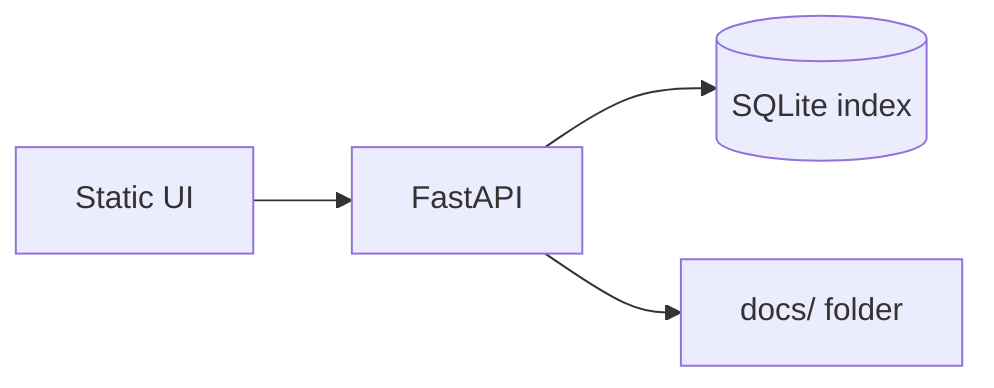

# Worked example — Campus Notes Helper

Same app through all six steps. Compare **Basic vs Advanced** output *shape* — not copy-paste AI answers.

**Terms:** [GLOSSARY.md](GLOSSARY.md) · **SPR** = Security, Performance, Resiliency · **MVP** = Minimum Viable Product · **PRD** = Product Requirements Document · **NFR** = Non-Functional Requirements · **API** = Application Programming Interface

**Idea:** Students upload markdown notes; app indexes by course code; Q&A answers **only from their notes** (keyword search first).

---

## Step 1 — Market research

**Basic prompt:** “Is a campus notes app a good idea?”

**Basic output shape:** “Yes, students need notes apps.” No interviews, no competitors.

**Advanced prompt:** (from [01-market-research.md](01-market-research.md)) with idea = “Campus Notes Helper”, users = CSE batch ~120.

**Advanced output shape:**

```markdown
## Problem
Students re-read entire folders before exams; no search by topic.

## Alternatives
| Alternative | Gap |
| Google Drive search | No course tagging |
| WhatsApp PDFs | No consent / version chaos |

## Kill criteria
- If <5 classmates will upload notes in week 1, pivot (change direction) to solo use only.

## SPR (Security, Performance, Resiliency) risks
- Security: do not store other students' notes without permission
- Performance: search must feel instant on 50 files
- Resiliency: if index corrupts, offer re-index button
```

---

## Step 2 — Requirements

**Must story (from advanced PRD — Product Requirements Document):**

> As a student, I want to search my notes by keyword so that I find a topic in seconds.

**NFR (Non-Functional Requirements) snippet (testable):**

- Security: no API keys in repo; upload only user's own files
- Performance: search 200 chunks under 2 seconds on laptop
- Resiliency: **SQLite** database index rebuild from `docs/` folder

---

## Step 3 — Design

**Mermaid (advanced):**



**API row:** `GET /search?q=` → HTTP 200 + `[{path, snippet}]` | 400 if query empty

---

## Step 4 — Implement

**Intermediate:** `@ARCHITECTURE.md` implement `GET /search` only + pytest.

**Advanced adds:** env-based config, 422/400, no stack traces in JSON, one resiliency test for empty index.

---

## Step 5 — SPR test loop (Security, Performance, Resiliency)

**Finding (example Critical):** Search returns other users' paths if multi-tenant added too early.

**Fix prompt:** “Scope **MVP (Minimum Viable Product)** to single-user only; document in ARCHITECTURE; add test that only `docs/` owner paths appear.”

Re-run `pytest` → close Critical.

---

## Step 6 — Deploy

**DEPLOY.md essentials:**

- `.env`: `NOTES_DIR=./docs` (name only in repo)
- Run: `uvicorn` + open UI
- Backup: copy `notes.db` before demo
- Rollback: `git checkout v0.1-demo`

---

## Your turn

Replace “Campus Notes Helper” with your hackathon idea. Keep the **same file names** (`RESEARCH.md` → … → `DEPLOY.md`) so context packs cleanly in Claude Projects or Cursor.

Full prompts: [01](01-market-research.md) → [06](06-secure-deployment.md)
